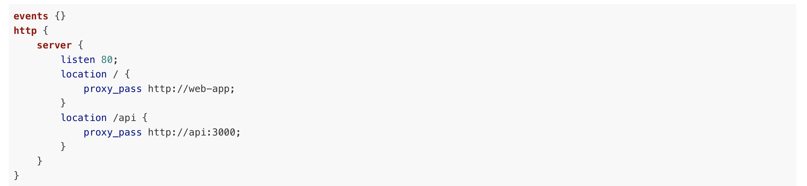
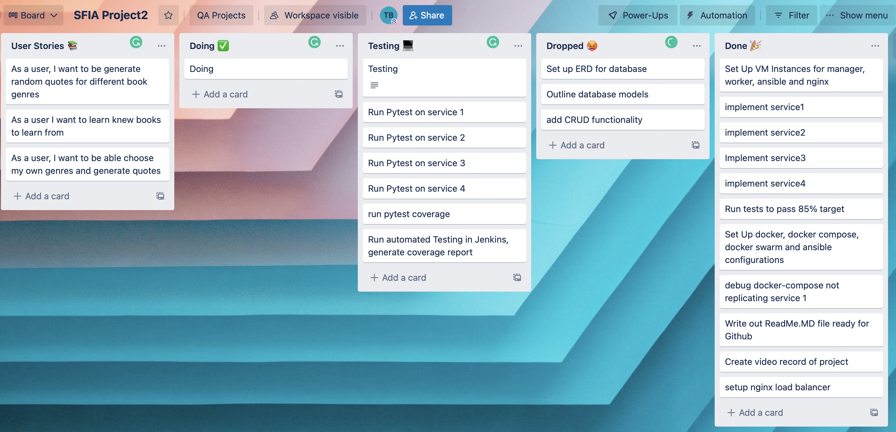
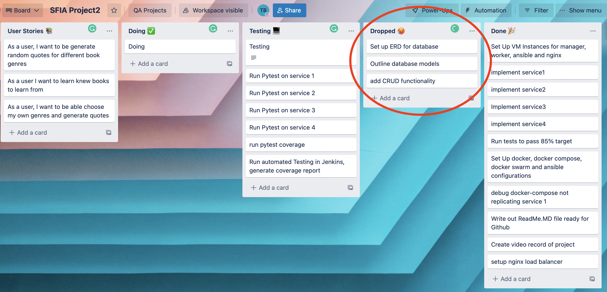

# sfiaproject2

* [Brief](#brief)
    * [Additional Requirements](#additional-requirements)
* [Build Instructions For Application](#build-instructions-for-application)
* [Planning](#planning)
* [Application Structure](#application-structure)
    * [Risk Assessment](#risk-assessment)
    * [Risk Assessment Updates](#risk-assessment-updates)
    * [CI Pipeline](#ci-pipeline)
* [Automated Testing](#automated-testing)
* [Front-End Design](#front-end-design)
* [Future Improvements](#future-improvements)
* [Authors](#authors)

# [(For Presentation click here)](https://drive.google.com/file/d/1HzHP5fvzp_T-OpQBZvpigLzSFkZ3x1cm/view?usp=sharing)
# Brief

The following README document takes the user through the second project we have been    
tasked with creating an application focused on executing service oriented architecture    
with four services working together.
  

This was to implement CI, cloud fundamentals and additional python skills we had learnt 
since our first Flask App project.
  

## Additional Requirements
We were expected to display use of the following tools and skills:

* Kanban Software
* Risk Assessment
* Source Control and appropriate use of dev and feature branches
* Webhooks to ensure code changes are updated and comtinually integrated.
* 4 seperate services interacting in unison
* Successful deployment of app
* Use of Ansible playbook 
* Use of reverse proxy
* Nginx for load balancing (recommended)

# Build Instructions For Application
Here are build instructions for the user to set up and deploy the application.

1. Head to https://console.cloud.google.com and set up Virtual Machine instances  
namely: _**-Ansible-Jenkins -manager -worker -nginx**_
  
2. Make sure to generate _**SSH keys**_ and add them to Ansible-Jenkins VM in GCP with the following commands:
* ssh-keygen 
* cat ~/.ssh/id_rsa.pub
3. Head back to VSCode and open remote connection (bottom left corner) and connect to new host  
within Ansible-Jenkins VM with your _**username@\<VM ip address\>**_
  
4. Run the _**sudo apt update**_ command in your working terminal
  
5. Clone down your repo using the following command so that you can maintain source control requirements:
* git clone \<https github repo link\> 
_(Step 5 will be essential for setting up your webhook within Jenkins automation)_
6. You now need to open a new host connections to run _**manager**_ and _**worker**_ VMs  (repeat step 2 and 3 with out ssh-keygen command)  
7. **Docker**: in order to deploy app you will need to run docker-compose.
* Create docker.sh file and enter the official script from https://get.docker.com\   inside the file:
 i. sudo apt-get update
 ii. sudo apt install curl -y
 iii. curl https://get.docker.com | sudo bash
 iv. sudo usermod -aG docker $(whoami)  
8. Install _**nginx**_ and configure it using the following command:  * _**sudo apt install -y nginx**_   
9. you still need to edit the nginx configuration file (nginx.conf)(which is our load balancer) use the following 
code in the aforementioned file: 
 
(You will need to change the ip addresses to the _**2 VM private addresses**_ you should have from _**step 6**_)  
10. Finally activate Ansible to deploy using _**ansible-playbook -i inventory.yaml playbook.yaml**_.
# Planning
Here is my Trello kanban board which shows how I planned and went  
about breaking user stories and sprints down into steps. 

#   Application Structure

  
As you can see, my original plan was to have CRUD functionality and a corresponding  
database. My idea for the app changed as I spent increasing time troubleshooting mainly Ansible, and syntax errors. 
 
## Original app architecture vs current displayed below:

  
## Risk Assessment
 
My risk assessment pertains to the risks I found to be most common for the type of app we  
building. I wanted to avoid including every generic possibility. I fouced on adding aisk  
assessment updates
 

